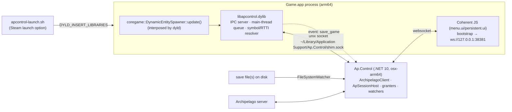

# macOS native port of Ap.Control — plan v2

> **Continuing this work?** Start at **§0.6**, which has the toolchain, the commands, what is done,
> and what the remaining work is in the order to take it. §0.5 is the status; the rest is the plan
> and the record of what was learned against it. Where doing the work contradicted the plan, the
> plan has been corrected in place and the correction marked, so a section can be trusted as it
> reads.

This replaces the v1 plan. v1 assumed the Windows model had to be re-created on macOS
(`task_for_pid` + `mach_vm_*` from a foreign process, AArch64 shellcode, inline detours with
thread suspension). Research against the local install shows that model is both unnecessary and
the wrong fit for macOS. Everything below was verified on the Steam build installed on this machine
(`Game.app` 1.34, Steam buildid 21225456, `Game` LC_UUID `CF65DC88-F5CE-38A4-8A2A-21FD5F43F14B`).

## 0. TL;DR

- **Upstream:** `main` == `v1.2.1` (compare: ahead 0 / behind 0). Nothing to upgrade to. The only
  unmerged branch, `add_gog_support`, adds a Windows GOG `GameBuildProfile` — irrelevant here.
- **Patcher:** still a small retarget (pack format, targets and patch strings all verified on the
  Mac `.rmdp`s). Unchanged from v1 apart from build details in §6.
- **Client:** do NOT port the Windows process-memory stack. Instead ship a small **in-process
  helper dylib** (`libapcontrol.dylib`) that the game loads at startup, plus a launch wrapper. The
  .NET client keeps its architecture and talks to the dylib over a local socket.
  This is possible because the game's own code signature *allows* it (§1) and desirable because it
  removes every macOS-hostile ingredient: no `task_for_pid` (root / SIP), no cross-process writes,
  no executable-memory allocation, no code-page patching, no thread suspension, no icache work.
- **Address hunting mostly disappears.** The Mac build is split into ~30 dylibs and `coregame.dylib`
  alone exports ~54,000 fully-named C++ symbols. The pump we hook, `saveGame`, the
  `GameObjectManager`, the `FlowConnectionManager` singleton and `makeStringCRC32` are all
  `dlsym`-able. The stripped main executable still carries RTTI name strings, so the two vtables we
  scan for are found at runtime by a typeinfo walk. Only a handful of game-specific functions
  remain to be located by reverse engineering, and the script/RPC method names and the compiled-in
  developer debug page make that cheap.
  *Correction from doing it:* there are **no** name→function tables. The RPC dispatcher compares an
  incoming name against each one it knows and calls the handler inline, so the names are referenced
  from code, not data — which is still cheap, but by a different route (§4.3-C). Searching the data
  sections for them finds nothing, and that absence is not evidence the names are unused.
  *And it turned out cheaper still:* every `Game` function the port needs was found by name — three
  through that dispatcher, and the item grant through the **script-binder instantiations**, whose
  RTTI names spell out each bound method's C++ signature in full (§4.3-A). Neither a signature scan
  nor the debug page was needed, and no address was found by pattern.
- **"Communicate without modifying memory" — verdict:** not fully achievable for grants (§2 explains
  what was checked). What *is* memory-free stays memory-free: elevator gating (pure JS), the in-game
  UI, and location tracking (save file on disk, with the dylib only *announcing* that a save
  happened). Everything else becomes "call the game's own functions, in-process, on its own main
  thread" — which is the closest thing to a supported API this engine has.

## 0.5 Status
Phases 0, 1 and 2 are built and on the `macos-port` branch, and Phase 3's reverse engineering is
finished — every address the client needs is mapped and implemented. What runs today:
- **Patcher** works against the real install. All four patches resolve their targets and dry-run
  length-neutrally with every balancer and record-boundary validator satisfied.
- **Shim** loads, interposes the pump and `saveGame`, and serves the socket. `make -C native/apshim
  check` proves it end to end against stand-in binaries that export the same mangled symbols, so it
  runs in CI on a machine with no copy of the game.
- **Client** selects the macOS backends, identifies the build by LC_UUID, and reconciles GameFlow
  state (clearance, sector flags) through the shim.
- **Object discovery** needs no per-build address: the `vtable` op walks the binary's RTTI, and
  `MacPlayerInventory` sweeps the heap for the player's inventory and picks the authoritative
  replica. Confirmed against the running game — 46 inventory objects, two of them the player's,
  roles 3 and 2, re-found after a reload. `Ap.Control probe-game` prints each step.
- **Progressive milestones work** — the extra weapon slot and both mod slots. Phase 3 found the
  game's own methods for them (§4.3-C) and confirmed them by calling them in a live game.
- **Item and ability grants work** — both called in a live game and both verified in the save
  written afterwards (§4.3-A, §4.3-B). They run on the game's own methods, with the shim's scratch
  buffer carrying the definition GID into the game. The profile has no zeroes left, and every
  address in it has now been confirmed by running it rather than by reading it.

Four things came out differently from the design below, all deliberate:
1. **Requests are whitespace-separated tokens, not JSON** (responses are still JSON). Every argument
   is a number, a hex blob or a mangled name, so the shim needs no JSON parser inside the game's
   address space; the client keeps a real one for the structured half.
2. **A `keys` op replaces per-variable scanning.** GameFlow reconciliation asks about two dozen
   variables a second. `keys` sweeps once for every name hash at a time and returns each hit with
   the surrounding bytes, so classification needs no follow-up read. Without it the choice was two
   dozen heap walks or hundreds of round trips, every second.
3. **No `pump_state` event.** The `pump` op answers the same question when the client actually wants
   to know, and the client is already polling on its reconcile tick. An event nobody subscribes to
   between polls is machinery for its own sake.
4. **The RTTI walk finds the name string by section flags and disambiguates by `type_info`**, rather
   than looking in `__TEXT,__cstring` for a string that starts at a NUL boundary. Both halves of that
   assumption are wrong on this build; §4.2 has the detail. The walk as built would have found these
   classes under either assumption, but it also finds `15UIAbilitiesMenu`, which the original rule
   would have silently missed — and silently is the problem, since the result is a heap scan for a
   vtable address of zero.

One bug surfaced while running it: `SaveFileWatcher` threw on a missing directory. Harmless on
Windows, where the memory source is the default, but fatal on macOS where the file source is and a
player who has never saved has no such directory. It now waits for the directory.

## 0.6 Picking this up

Written for someone who has not been here before. Everything is current as of the head of
`macos-port`.

### Install

| What | Why | Note |
|---|---|---|
| Xcode Command Line Tools | `clang++` builds the shim; `xcrun llvm-objdump` reads the game binary | |
| .NET SDK 10 | client and patcher | |
| Ghidra | reading a handful of functions out; `macho.py` answers everything that is a pattern rather than data flow | `brew install ghidra`. It pulls `openjdk@21`, which Homebrew keeps keg-only, so **every** headless invocation needs `JAVA_HOME` set — see `native/re/README.md` |
| Control, Steam macOS 1.34 | every address in the profile is for this build only | `Game` LC_UUID `CF65DC88-F5CE-38A4-8A2A-21FD5F43F14B` |

`native/re/macho.py` needs Python 3 and no packages.

### The loop

```sh
make -C native/apshim check     # shim, end to end, no game needed — run before and after touching it
make -C native/apshim install   # quit Control FIRST; see below
dotnet build                    # client
```

`install` renames into place, which does not disturb a game that is already running — and equally
does not reach it. A running Control keeps executing the copy it mapped at launch, so a shim change
only takes effect after quitting and relaunching. The symptom is a client that reports a capability
missing however many times the dylib is reinstalled; `probe-game` prints the scratch buffer, and its
absence is that.

Then launch Control from Steam with the launch option of §5.1 set, and:

```sh
./bin/Debug/net10.0/osx-arm64/Ap.Control probe-game
```

The shim serves several clients at once, so `probe-game` and a running client coexist. If a command
hangs for 70 seconds and then reports nothing listening, that is the client's reply timeout: check
`~/Library/Logs/Ap.Control/shim.log` for whether the dylib loaded at all.

### The diagnostics, and when to reach for each

| Command | Answers |
|---|---|
| `probe-game` | Is the shim up, which build, is the pump ticking, can the player's inventory be found — each step printed separately, so the one that broke is visible |
| `probe-game --layout [<rtti-name>]` | Where does this build keep a class's fields? Compares every instance in memory. Finds anything with a *shape*: a flag set on one or two objects, a two-bit network role. Takes any class. What it cannot find is a field with no shape — a count is any small number — which is what sends you to the disassembler (§4.4) |
| `probe-game --layout --snapshot <path>` | What changed in the player's object between two runs? For fields with no shape — a count is any small number. Snapshot, do the thing in game, run again. The noise floor is zero, so one observation is enough. `--window 0x800` if a diff comes back empty |
| `try-unlock weapon-slot \| mod-slot <0-3> \| ability <gid> \| item <gid> [<amount>]` | Is an address really the function it looks like? Calls it in the live game, one function at a time, with the object and the arguments printed first. Refuses unless the object carries the right vtable and the pump is ticking. **Changes the player's game**, and everything but `item` saves itself |
| `dump-save [<path>]` | What checks would this save report? No game, no server |

### What is done, and what the remaining work is

Phases 0–3 are complete (§10). All four addresses are mapped, every one of them confirmed by
calling it in a live game, and the profile has no zeroes. What is left is **Phase 4** — CI, README,
`install-launcher` / `--launch`, release notes.

### Known-unknowns worth not rediscovering

- The Ghidra project lives wherever you put it and is not in the repo. Re-importing `Game` takes
  about five minutes and 250 MB; put it somewhere that survives the session (`~/ghidra-projects`
  is what `native/re/README.md` uses).
- Every address in the profile moves when the game updates. `native/re/` exists so re-deriving them is
  a repeatable procedure rather than a fresh investigation — §4.3 records how each was found, not
  just what it is. Two routes cover all four: the RPC dispatcher's inline name comparisons, and the
  script-binder instantiations, whose RTTI names carry each bound method's full C++ signature.

## 1. Verified facts

| Subject | Finding | How verified |
|---|---|---|
| Install | `~/Library/Application Support/Steam/steamapps/common/Control/Game.app`; binaries in `Contents/MacOS`, data in `Contents/Resources/data_packfiles` | `ls` |
| Architecture | `Game` and every engine dylib are **thin arm64** Mach-O (no x86_64 slice → no Intel/Rosetta target to support) | `file` |
| Code signing | Developer ID (Remedy, team `WPFU4HYKCV`), **hardened runtime** (`flags=0x10000(runtime)`), no `__RESTRICT` segment | `codesign -dvvv`, `otool -l` |
| Entitlements | `com.apple.security.cs.allow-dyld-environment-variables`, `com.apple.security.cs.disable-library-validation`, `com.apple.security.cs.allow-jit`, `network.client` | `codesign -d --entitlements -` |
| ⇒ Injection | The first two entitlements are exactly what makes `DYLD_INSERT_LIBRARIES` honoured for a hardened-runtime app and lets it load a dylib signed by a different (or ad-hoc) identity. No SIP change, no root. | dyld/AMFI policy |
| Symbols | `coregame.dylib`: 54,433 exported defined symbols (127k incl. local); `coreshared.dylib` 11,817; `rl.dylib` has `r::FlowConnectionManager::*`, `r::makeStringCRC32`; `Game`: 285 exports, local symbols stripped, but 3,592 **named imports** | `nm -gU`, `nm -u` |
| Pump | `coregame::DynamicEntitySpawner::update()` is exported (`_ZN8coregame20DynamicEntitySpawner6updateEv`, coregame+0x143c78), is **imported by `Game`**, and has **zero internal callers inside coregame.dylib** → every call goes through the dynamic linker → **dyld interposing works** with no code patching | `nm -u Game`, `otool -tvV coregame.dylib` |
| Other dlsym-able anchors | `coregame::GameHelper::saveGame(net::NetworkRole,bool,bool)` (`_ZN8coregame10GameHelper8saveGameEN3net11NetworkRoleEbb`), `coregame::GameObjectManager::getInstance()` / `sm_instances`, `r::FlowConnectionManager::sm_pInstance` (`_ZN1r21FlowConnectionManager12sm_pInstanceE`), `r::makeStringCRC32(char const*, unsigned)`, `d::BaseTweakable::setTweakable(char const*, char const*, bool)`, `coregame::ScriptEventHandler::postGameEvent/postScriptMessage(GameObjectState*, char const*)` | `nm` |
| RTTI | `Game` **`__TEXT,__const`** (not `__cstring`, as v2 of this plan assumed) contains the Itanium typeinfo names `27GameInventoryComponentState`, `30PlayerPropertiesComponentState`, `5UIHud`, `15UIAbilitiesMenu`, `31AbilityUpgradeModComponentState`. Each is named by exactly one `type_info` in `__DATA_CONST,__const`, which is in turn named by one vtable — two for `5UIHud`, which has a secondary at `offset_to_top -8`. → vtables locatable at runtime | `strings`, chained-fixup decode of `__DATA_CONST` |
| Script/RPC name tables | `Game` contains the script-facing method name tables of its internal client/server message managers, e.g. `SaveGame`, `UnlockSecondaryWeaponSlot`, `UnlockCharacterModSlot`, `AddAbilityPoints`, `RemoveAllAbilityUpgrades`, `SetGlobalBoolVariable/IntVariable/FloatVariable`, `GetGlobalBoolVariable…`, `UnlockControlPoint`, `DropLootItem`, `AddMission`, `CompleteStep`, followed by `Error executing RPC, target: ServerGameMessageManager` / `ClientGameMessageManager`. Dispatch machinery: `net::RPCDispatcher::onRPCReceived(int, short, r::BufferedMemoryStream&)` (exported from `network.dylib`) | `strings`, `nm` |
| Dev tooling left in | A native debug page (`DebugPanel::DebugPage`) with buttons "Give all ability unlocks", "Give all ability unlocks + upgrades", "Give sec. weapoon slot", "Remove all ability unlocks + upgrades", "Award Ability Points", "Award Essence", "Unlocked Control Points (click to jump)"; a `DevCommandServer` RPC target with `executeServerDebugEvent`, `executeScriptEventByIndex/ByOffset`, `debugTeleport`, `episodeControllerSetTaskComplete`… Also two `*-development-000` packfiles (323 MB + 634 MB) are shipped. | `strings` |
| Coherent UI | Shipped views: `menu.ui persistent.ui hud.ui index.ui intro.ui loadingscreen.ui photo.ui splash.ui system.ui expedition-*.ui`. C++→JS handlers are UI-shaped (`OnShopUpgradeRequested`, `OnItemCrafted`, `OnControlPointClicked`, …) — all economy/flow gated. The debug page is **not** a Coherent view. | pack index, `strings` |
| Pack data | Same `.bin` index + `.rmdp` layout, same package names; `persistent.ui` / `menu.ui` / `hud.ui` sizes `917753 / 293176 / 1662224`; **all** patch anchor strings and balancer markers present verbatim | v1 research, unchanged |
| STL | Engine uses libc++ `std::__1::map` (58 instantiations in coregame). libc++ tree node = `__left_, __right_, __parent_, __is_black_(+pad)` = 0x20 bytes before the key — same distance as MSVC's `_Left,_Parent,_Right,_Color,_Isnil` → the existing GameFlow "three heap pointers before the key" heuristic transfers, but the pointer-range constants must change (§4.3-D) | `nm`, libc++ source |
| Saves | None exist yet (game launched once: only `~/Library/Application Support/com.remedygames.control-ue-steam/{renderer.ini,LSAO}`). Steam Cloud is active (`userdata/<id>/870780/remote/preferences_data`). Save subsystem strings: `savegame-slot-%02d`, `persistent`, `SaveGame::MetaData`; `platform.dylib` speaks of "savegame slot size / concurrent save operations" (console-style slot containers). Location and container format are **open** (§7). | `find`, `strings` |
| Steam launch (macOS) | Steam launches `.app` bundles through LaunchServices → `VAR=x %command%` launch options do **not** propagate env (documented by MelonLoader's 2026 macOS work and Valve issue #5548). The working pattern is a wrapper: launch option `"/path/to/wrapper.sh" %command%`; the wrapper merges `STEAM_DYLD_INSERT_LIBRARIES` (overlay) with our dylib and `exec`s `Game.app/Contents/MacOS/Game` directly. | web research |
| Dead code | `Memory/NativeUiModelController.cs` / `IUiModelController` are referenced by nothing (`Program.cs` never constructs them; elevator gating is the JS `window.APEV` path). `UiHudVtable` is therefore not needed on macOS. | `grep` |

## 2. Channel evaluation — why in-process

Requirement from the brief: prefer a way to talk to the game that does not modify memory; if that
is impossible, pick the approach that fits the macOS model best.

| Option | Can it grant items / abilities / flags? | Verdict |
|---|---|---|
| **A. Coherent UI JS only** (what `menu.js` + the bootstrap already do) | Only what the game already exposes to its UI: shop craft (costs materials), ability buy (costs points), elevator travel, control-point jump. No point-free or item-spawn handler exists. | Keep for everything UI-shaped (status page, elevator gating via `window.APEV`). Cannot carry grants. |
| **B. Save-file editing** | The game reads the save only at load. Writing items into `persistent` between sessions is offline-only and fights the game's own writes. | Rejected for grants. Save **reading** remains the location-tracking source (§7). |
| **C. External API / console / network** | The engine has an internal client/server RPC layer (`net::RPCDispatcher`, `CommunicationPipe`) but it is in-process loopback; no socket, no console, no file command channel is exposed. `DevCommandServer` exists but is reachable only from inside the process. | Nothing externally reachable. |
| **D. Foreign-process Mach memory** (v1 plan) | Works in principle, but `task_for_pid` on a hardened Developer-ID app without `get-task-allow` needs root or SIP off, and every write/exec step (remote code pages, `mach_vm_protect` of `__TEXT`, thread suspension, icache) fights the platform. | Rejected. |
| **E. In-process helper dylib** (`DYLD_INSERT_LIBRARIES`) | Same address space as the game: calls game functions by exported name, hooks the per-frame pump by dyld **interposing** (data-only, done by dyld at load), reads its own memory safely, no privileges. This is the standard modding model on macOS (MelonLoader, BepInEx, Steam's own overlay use the same door). | **Chosen.** |
| F. Whole client in-process via .NET NativeAOT shared library | Would remove the IPC hop, but puts a GC, signal handlers and `Archipelago.MultiClient.Net` (reflection/JSON, trimming warnings) inside a game that installs its own crash handling. | Rejected for now; keep as a later consolidation idea. |
| G. Helper dylib exposing itself to JS through Coherent's C++ binding API | Would reuse the existing WebSocket instead of a second socket, but Coherent GT headers are proprietary → ABI guessing. | Rejected. |

So: **E for grants, A + B for everything that can stay memory-free.** Within E, prefer the game's
*semantic* entry points (the script/RPC-level methods and debug-page callbacks in §4.3) over raw
struct pokes wherever both exist, because they run the same code the game runs when a mission grants
the same thing (persistence, UI refresh, replication to both network roles).

## 3. Architecture



Components:

1. **`native/apshim/` → `libapcontrol.dylib`** (C++17, clang from Xcode CLT, ~600–900 lines, no
   third-party deps). Responsibilities: (a) interpose the pump and run a main-thread call queue,
   (b) interpose `saveGame` to emit a `save_game` event, (c) answer IPC requests: symbol lookup,
   RTTI vtable lookup, image bases/UUIDs, region enumeration, fault-safe read/write, in-process
   signature scan, main-thread call, and — once mapped — semantic commands (`give_item`,
   `grant_ability`, `unlock_weapon_slot`, `set_global_bool`, …). Logs to
   `~/Library/Logs/Ap.Control/shim.log`.
2. **`apcontrol-launch.sh`** — the Steam launch wrapper (§5).
3. **`Ap.Control`** (.NET) — unchanged Archipelago/UI/save logic. New macOS implementations of
   `IItemGranter`, `IAbilityGranter`, `IGameFlowController`, `ISaveWatcher` that speak to the shim;
   selection by `OperatingSystem.IsMacOS()` in `Program.cs`. The Windows classes are left untouched
   to avoid regressing the shipped release.
4. **`Ap.Control.Patcher`** — retargeted (§6).

### 3.1 IPC protocol (client ⇄ shim)

- Transport: Unix domain socket, shim is the **server** (its lifetime is the game's). Path
  `~/Library/Application Support/Ap.Control/shim.sock`; the shim `unlink`s a stale socket on start.
  The client connects with backoff (same policy the JS bootstrap uses) and treats disconnect as
  "game not running".
- Framing: `u32 length (LE)` + `u8 kind` (`0 = JSON`, `1 = raw bytes`) + payload. Requests are JSON
  with `id`, `op`, params; responses carry the same `id`. Raw-byte frames are used only for `read`
  responses and `write` request bodies. Unsolicited frames with `"ev"` are events.
- Operations (v1 of the protocol — enough to port every existing scan/grant path 1:1):

| op | params → result | notes |
|---|---|---|
| `hello` | → `{pid, ticking, beats, scratch, scratch_len, images:[{name, base, slide, uuid, exe}]}` | `Game`'s UUID keys the build profile (§4.1); `scratch` is the buffer below |
| `dlsym` | `{sym}` → `{addr}` | `dlsym(RTLD_DEFAULT, sym)`; `sym` without the leading underscore |
| `vtable` | `<rtti-name> [image]` → `{image, name, typeinfo, vtables:[{addr, top}]}` | §4.2. `addr` is the address point — what an instance's first word holds — so a heap scan can use it directly. Primary (`top` 0) first. |
| `regions` | `{writable:true}` → `[{base, size, prot, share_mode}]` | `mach_vm_region_recurse` on `mach_task_self()` — unprivileged |
| `read` | `{addr, len}` → raw bytes (short read allowed) | `mach_vm_read_overwrite` on self: returns an error instead of faulting on unmapped pages |
| `write` | `{addr}` + raw body → `{written}` | same guard; only writable regions |
| `scan` | `{pattern(hex), align, lookahead, regions?:"writable"}` → `{hits:[addr]}` | in-process, so a full sweep is tens of ms rather than seconds; validator callbacks stay in C# (the client re-reads a `lookahead` window per hit) |
| `call_main` | `{fn, x:[≤8 u64], d:[≤8 f64 bits], timeout_ms}` → `{x0, beats}` | executed inside the interposed pump (§3.2). `beats` = pump ticks observed while waiting (same diagnostics as the Windows heartbeat) |
| `event:save_game` | `{role}` | from the `saveGame` interposer, after the original returns |
| `event:pump_state` | `{ticking:bool}` | emitted when the pump starts/stops ticking (menu vs gameplay), so the client can explain deferred grants |

Semantic ops were proposed for Phase 3 (`give_item`, `grant_ability`, `unlock_weapon_slot`, …) as
thin wrappers over `call_main`. In practice none has been needed: the milestone grants are one
`call` each with addresses the client already holds, and a wrapper per grant would move C# logic
into the game's address space for no gain. Add one only where it buys something.

**One op was genuinely missing** — the client had no way to put bytes somewhere inside the game and
pass their address, and both grants need that: §4.3-A takes a pointer to a 24-byte `GlobalIDPointer`
and §4.3-B a pointer to a `GlobalID`, while `write` needs a target that already exists. Two ways were
considered: `alloc`/`free` over `malloc`, general but leakable; or one fixed static buffer in the
shim whose address and size `hello` reports.

**Built as the second**, and it is enough: the client serialises requests and the shim runs one
main-thread call at a time, so nothing can be using the buffer concurrently, and there is nothing to
leak. 256 bytes, 16-byte aligned, reported as `scratch` / `scratch_len`. A shim older than the
grants reports no buffer, and the granters say so by name rather than writing to address 0.

`native/apshim/test/checkclient.cpp` covers the whole path in one case — `hello` names the buffer,
`write` fills it, `call` hands a callee its address and a **`float`**. The float is the half worth
testing: it arrives in `s0`, the low word of `d0`, so a client that writes the *double* bit pattern
of 1.0 passes a denormal near zero and the grant quietly does nothing.

### 3.2 Main-thread execution

- Interpose entry (in the dylib):
  ```
  extern "C" void ap_orig_pump(void* self) __asm__("_ZN8coregame20DynamicEntitySpawner6updateEv");
  static void ap_pump(void* self) { g_heartbeat++; drain_main_queue(); ap_orig_pump(self); }
  __attribute__((used)) static struct { const void* repl; const void* orig; }
      ap_interpose_pump __attribute__((section("__DATA,__interpose"))) = { (void*)ap_pump, (void*)ap_orig_pump };
  ```
  Link with `-Wl,-undefined,dynamic_lookup` (coregame.dylib is a direct `@rpath` dependency of
  `Game`, so it is in the image list when dyld binds the inserted library). Keep the struct out of
  `-dead_strip` (`__attribute__((used))` + `-Wl,-u,_ap_interpose_pump` or just don't dead-strip).
  `update()` is a member function → the replacement receives `this` in `x0`; pass it through.
- Calls run *before* the original body, i.e. at the same frame boundary the Windows detour used.
  Exceptions: wrap each queued call in `try { … } catch (...)` — the engine throws (`R_Throw<…>`)
  and an unwind through the pump would kill the game.
- Argument passing: a queued call is invoked through a pointer typed
  `uint64_t (*)(uint64_t x0..x7, double d0..d7)`. AAPCS64 puts the eight integer args in `x0–x7`
  and the eight FP args in `d0–d7` regardless of their textual position, so a callee that takes
  `float` reads `s0` = the low 32 bits of `d0`. To pass a `float`, put its bit pattern in the low
  half of `d[0]` (union), leave the rest zero. This covers `GiveItemFromDefinition(this, char, GID*, float)`
  without any assembly.
- Liveness: heartbeat counter + a 5 s timeout per call, with the same two error texts the Windows
  client prints ("pump never ticked — menu/pause" vs "ticked but request not serviced").
- Fallbacks if interposing does not take (not expected, verify in Phase 0): (1) pick another
  per-frame symbol that `Game` imports from an engine dylib; (2) rebind the `Game` image's
  `__DATA_CONST,__got` slot for the symbol after `mach_vm_protect(...VM_PROT_READ|VM_PROT_WRITE)` —
  still a data write, still no code patching (the binary is plain arm64, not arm64e, so no PAC).
  Inline hooking (Dobby etc.) is the last resort and should not be needed.

## 4. Address resolution — what replaces `GameBuildProfile`

### 4.1 Keying

Key macOS profiles on the `Game` **LC_UUID** (from `hello`), not a SHA-256 of a 14 MB file. Report
`CFBundleShortVersionString` and Steam `buildid` (from `steamapps/appmanifest_870780.acf`) in
error messages the way `DescribeUnknown` does today. Current build: UUID
`CF65DC88-F5CE-38A4-8A2A-21FD5F43F14B`, 1.34, buildid 21225456.

### 4.2 Field-by-field

| Windows profile field | Used by | macOS resolution |
|---|---|---|
| `CoregamePump` | ability RPC hook | **dlsym / interpose** `_ZN8coregame20DynamicEntitySpawner6updateEv` — no offset |
| `SaveGameThunk` | post-grant save | **dlsym** `_ZN8coregame10GameHelper8saveGameEN3net11NetworkRoleEbb`, call as `saveGame(role, 0, 0)` on the main thread |
| `FlowConnMgrHolder` | pin fire | **dlsym** `_ZN1r21FlowConnectionManager12sm_pInstanceE` → `*(void**)addr` |
| `GomContainer` | ability-upgrade entity scan | **dlsym** `_ZN8coregame17GameObjectManager12sm_instancesE` (or call `getInstance()`); re-verify the `GomRoleOffsets {-8,0,8}` / `GOM_TABLE 0x310` / `ENT_*` layout (§4.4) |
| `InventoryVtable` | player-inventory scan | **DONE** — RTTI walk for `27GameInventoryComponentState` (below), driving `MacPlayerInventory` |
| `AbilityMgrSlot` | ability manager | **DONE** — the object comes from `PlayerPropertiesHolder`, the route the game's own dispatcher takes, and is checked against the RTTI walk for `30PlayerPropertiesComponentState` before use (`MacPlayerProperties`). Serves the ability grant and both milestones. The heap-scan fallback is not built; nothing has needed it |
| `UiHudVtable` | dead code | **drop** |
| `GiveItemFromDefinition` | item grant | **DONE** — `Game+0x4f0bc0` (§4.3-A); per-build offset |
| `FireApplyPin`, `FirePin` | ability grant / milestone | **dropped** — §4.3-B's `UnlockAbilityUpgrade` fires the apply pin itself, and §4.3-C's milestone methods need no pin at all. `FireApplyPin` is `Game+0x894f08` on this build if a fallback is ever wanted |
| `MilestoneThresholds` ×3 | milestone grant | **dropped** — `UnlockSecondaryWeaponSlot` / `UnlockCharacterModSlot` (§4.3-C) do behave, confirmed in game. No thresholds, no high-water mark, no reward pin |

RTTI vtable walk (done at runtime in the shim, Itanium ABI) — implemented in `native/apshim/src/rtti.cpp`:
1. In the `Game` image, find **every** NUL-terminated occurrence of `"27GameInventoryComponentState"`.
   Search by section *flags*, not by name: the sections worth searching are the ones in `__TEXT`
   without `S_ATTR_PURE_INSTRUCTIONS`, which is how the walk survives these names living in
   `__TEXT,__const` rather than in `__cstring` where this plan first put them.
2. Do not try to pick the right occurrence from the bytes around it — neither rule works. A name can
   be the NUL-terminated tail of a longer mangled one (`P5UIHud\0`), so a match is not proof; and
   requiring the name to *start* a string is wrong too, because `__TEXT,__const` is mixed constant
   data where `15UIAbilitiesMenu` is preceded by `0xc0`. Let step 3 choose instead.
3. Find the `std::type_info`: a pointer-sized word in a `__DATA*` section whose *second* word points
   at one of those occurrences (first word is the `__class_type_info` vtable, a bind). Exactly one
   occurrence has this, which is what makes it the disambiguator.
4. Find every location in `__DATA*` holding the typeinfo address whose *next* word is a code pointer
   — each is `vtable[-1]`; the vtable's address point is `+8`. The preceding word is `offset_to_top`;
   the primary vtable has `0`. Return all candidates (multiple inheritance yields secondaries) with
   their offsets; the heap scan uses the primary. "Is it code" is answered by the region's
   protection bits, which is also what rules out a derived class's `__si_class_type_info` — that
   names our typeinfo in the same way a vtable does, and is told apart by what follows it.
5. Read pointers from memory, not from the file: `__DATA_CONST` uses chained fixups on disk but is
   rebased in memory.

### 4.3 Reverse-engineering targets and recipes (Ghidra or Binary Ninja on `Game`)

The stripped `Game` is far easier than `Control_DX12.exe` was: every call into the engine is a named
import, all `Coherent::UIGT::*Binder<UIAbilitiesMenu::UIAbility>` etc. are exported, and RTTI is
intact (Ghidra's "RTTI Analyzer" / class recovery names the vtables for you).

**A. Item grant — `GiveItemFromDefinition` — FOUND**
- **`Game+0x4f0bc0`**, called as `(GameInventoryComponentState* this, GlobalIDPointer* item, float
  amount in s0)`, returning the `coregame::EntityState*` it created or 0. Note the second argument
  is a pointer to a **24-byte `r::GlobalIDPointer`**, not to a bare GID: the parameter is a class
  with a destructor, which AArch64 passes indirectly. Zero the whole thing and put the GID at +0 —
  the rest is a resolved-pointer cache, a generation and a spin-lock byte, and a stale 1 in that
  byte would hang the game inside its own copy-assign.
- It puts the item in the inventory; where it cannot, it spawns the drop at the player and adds
  that — which is what a mission reward does too. It does **not** save, so unlike C the grant leaves
  the save to the next one the game takes. That matches the Windows granter.
- **How it was found — the script-binder route, which is general.** The engine binds C++ methods to
  script by instantiating `ScriptBinder<M>` per method *signature*, and each instantiation leaves
  its own RTTI name in the binary. So `strings | grep ScriptBinderIM27GameInventoryComponentState`
  lists the class's bound methods **by type**, and one of them reads
  `EntityState* (GameInventoryComponentState::*)(GlobalIDPointer<content::LootDropItem>, float)` —
  the signature this section had been searching for by hand. From there:
  1. `vtable_of('12ScriptBinderIM27GameInventoryComponentStateFPN8coregame11EntityStateEN1r15GlobalIDPointerIN7content12LootDropItemEEEfEE')`
     → the instantiation's vtable, `0x100e0b970`.
  2. Whatever stores that vtable is that binder's constructor: `0x100512bc4`. It does
     `stp x8, x2, [x0]`, i.e. it keeps the bound method's address in `x2`.
  3. `callers_of(0x100512bc4)` → `0x10051460c`, one call. Read `x2` off the `adrp`/`add` pair that
     sets it up just above: `0x1004f0bc0`.
  The whole walk is a handful of `macho.py` calls and one `llvm-objdump`, and it works for any bound
  method of any class — worth remembering the next time a signature is known but an address is not.
- **Confirmed in a live game** with `Ap.Control try-unlock item <gid>`: granting a definition the
  player already held raised that row's quantity, and granting ones they did not add new rows, each
  carrying the `amount` passed. Both effects survived into the next save.
- Recorded so it is not re-walked: **`spawnAt`'s three callers are all dead ends** (`0x1003136a4`,
  `0x1004b4f70`, `0x1005829fc`), and so is `DropLootItem`'s handler at `0x10098782c` — that path
  spawns at a position, and the give-item path reaches the spawner only as its fallback.
  `AddToInventoryComponentState`'s vtable (`0x100dd4620`) holds only type-info accessors, and the
  `m_in_funcAddItem` strings are referenced solely from reflection registration, which gives a field
  offset rather than a function. None of that mattered in the end; the binder table did it.
- Below `0x1004f0bc0` are two more useful entry points, if a caller ever wants them:
  `0x1004c9c18(u32* ownerEntityHandle, GlobalIDPointer*, float)` is the same grant addressed by
  owner rather than by inventory, and `0x1004f48c4(GlobalID* out, inventory, GlobalIDPointer*)` is
  the pure "add to inventory, no world spawn" half.

**B. Ability grant — `ApplyAbilityUpgrade` — FOUND**
- **`Game+0x87a988`**, the RPC method `UnlockAbilityUpgrade`, called as
  `(PlayerPropertiesComponentState* this, GlobalID* definition)` and returning nothing. `this` is
  the same `*(*(Game+0xe68d60) + 0x20)` object the milestones in C use. The argument is the same
  24-byte `GlobalIDPointer` buffer as A — the handler reads only the GID at +0, but the game's own
  dispatcher hands it the whole structure, so the client does too.
- It is a better fit than the debug page this section originally preferred, because it *is* the
  whole grant: it walks the player's own ability-upgrade instances, resolves each through
  `r::GlobalIDMap`, matches `entity+0x78` (the archetype GID) against the definition, and fires the
  ability tree's apply pin — `this+0xf8`, through `r::FlowConnectionManager::sm_pInstance`, at
  `0x100894f08`. That is exactly what the Windows client assembles by hand out of `FireApplyPin`,
  the owner lookup and the pin handle, and none of those need mapping here.
- It calls `coregame::GameHelper::saveGame(role, 0, 0)` itself before returning, so a grant must not
  save again — the same correction C needed.
- Consequence worth knowing: an upgrade whose instance the player's tree has not created is simply
  not applied. That is the same outcome the Windows granter reports as "no live instance exists for
  the definition", so the behaviour matches rather than merely resembling it.
- Found by the route C established: `refs_to(find_string('UnlockAbilityUpgrade')[0][0])` →
  `0x100987dd4`, the dispatcher's comparison, and the handler is the `bl` at the end of that branch.
  Its mismatch branch falls straight into the next comparison, `RemoveAllAbilityUpgrades`
  (`0x100987eac` → handler `0x10087c260`), with `AddAbilityPoints` (`0x100988010`) a little further
  along — the neighbours this section expected to have to read, and did not.
- **Confirmed in a live game** with `Ap.Control try-unlock ability <gid>` — see below for how,
  since the Abilities menu is not available early in the story.
- **How to tell whether it took, without the Abilities screen.** Two independent ways, both cheap:
  - The function only reaches its `saveGame` *after* the apply pin returns true. A definition that
    matches no live instance, and a pin that refuses, both branch to the loop's advance and skip it.
    So the game saving at all is the signal.
  - The grant lands in the save's `Inventory` chunk as an **ActivePersistingItem** — a `{GID, 0}`
    pair in the list after the item rows. That is where Control keeps applied ability upgrades, and
    the GID is the definition GID that was granted, so `dump-save`'s parse (or sixteen lines of
    Python over `GameInventory`) answers it exactly.

- The debug-page lead is closed as unnecessary, but the finding stands for anyone who returns to it:
  the xref to `"Give all ability unlocks + upgrades"` (`0x100afbe70`) is the page's **construction**,
  storing a button handle at `page+0x190`; the callback is whatever later reads that slot.

**C. Milestones (weapon slot + 2 mod slots) — FOUND**
- There is no name-to-function table. The RPC dispatcher compares an incoming method name against
  each name it knows and calls the handler inline, so the names are referenced from code, not data.
  `native/re/macho.py`'s `refs_to()` gives the comparison site directly:
  `UnlockSecondaryWeaponSlot` → `0x100987f30`, `UnlockCharacterModSlot` → `0x100987f80`. The two are
  0x50 apart in the same chain, as the plan guessed.
- Reading each site out gives the handler and how it is called:

  | method | handler | call |
  |---|---|---|
  | `UnlockSecondaryWeaponSlot` | `0x10087c51c` | `(this)` |
  | `UnlockCharacterModSlot` | `0x10087c57c` | `(this, uint level)` |

  `this` is `*(*(0x100e68d60) + 0x20)` — the dispatcher's own route to the player-properties
  object. `0x100e68d60` is in `__DATA,__common`, so it is filled in at runtime, not on disk.
- **Confirmed in a live game** with `Ap.Control try-unlock`: both returned after one pump beat and
  both slots appeared. The client's milestone grant is implemented on them.
- The mod-slot argument is the **milestone level, not a slot index**. The method reads the level the
  player already has and acts only when asked for more, so levels 2 and 3 are simply passed through.
  Both methods are idempotent for the same reason, which makes a repeated progressive item harmless.
- **Neither needs a save afterwards**: both call `coregame::GameHelper::saveGame(role, 0, 0)`
  themselves before returning. The Windows path had to save separately; this one must not, and the
  instruction that used to be here was wrong for this build.
- `UnlockSecondaryWeaponSlot` also reads the network role at `this+0x10`, independently confirming
  §4.4's measured offset from the game's own code, on a different class.

**D. GameFlow flags / clearance (`KEY1..KEY6`, sector `*_CanTravel_*` bools)**
- Semantic path: `SetGlobalBoolVariable` from the same tables (its neighbours are
  `GetGlobalBoolVariable`, `SetGlobalIntVariable`, `SetGlobalFloatVariable`; the block precedes the
  `ClientGameMessageManager` RPC error string). Determine `this` (manager instance) and the
  argument shape (name string vs. CRC, value) from the deserialising stub / `*Params` class.
- Portable fallback (works day one): the existing CRC map-node scan, run through the shim's `scan`
  + `read` + `write` ops. Adjust `PTR_MIN/PTR_MAX` to macOS user space (`0x1_0000_0000 …
  0x0000_8000_0000_0000`; `__PAGEZERO` is 4 GiB so nothing valid lies below), keep `PRE = 0x20`.
  `KeyHash` can be validated against the engine's own `r::makeStringCRC32` via `call_main`.

**E. Save-blob discovery** — unchanged algorithm (`Magic` + `"persistent"` signature), run via
`scan`; only needed as the fallback described in §7.

### 4.4 Struct offsets are build-family specific

All hard-coded member offsets in the Windows code (`OFF_IS_PLAYER 0x90`, `OFF_NET_ROLE_FIELD 0x18`,
`OFF_ITEM_COUNT 0x48`, `MGR_OFF_* 0x28/0x30/0x50/0xf8/0x120`, `GOM_TABLE 0x310`, `ENT_INSTANCE_GID
0x18`, `ENT_ARCHETYPE_GID 0x80`, the GameFlow node layout `+0x08 type / +0x10 value`) come from the
MSVC build. clang/libc++ usually lays these classes out identically (same declaration order, LP64 vs
LLP64 only matters for `long`), but each must be re-confirmed on the Mac build before use. Cheap
checks: network-role top bits ∈ {2,3} on the inventory candidates, item count equal to the parsed
save's inventory size, `type ≤ 2` on GameFlow nodes, archetype GID low 14 bits == 77 on upgrade
entities. Put the confirmed values in the macOS profile record, not in constants.

**Measured, and they do differ** — "usually lays these out identically" did not survive contact with
`GameInventoryComponentState`. The GameFlow node layout transferred intact, but this class is
shifted: everything the Windows client reads sits **eight bytes lower**, because the class begins
with a base that clang lays out eight bytes shorter than MSVC does.

| Field | Windows | macOS 1.34 | How |
|---|---|---|---|
| player flag | `0x90` | **`0x88`** | four bytes read 1 on exactly the player's two replicas — `0x45`, `0x55`, `0x60`, `0x88` — but only this one is a flag. Reading all 73 live instances shows the rest: `0x45` and `0x55` are byte 1 of two vectors' *capacity*, which is 256 on the player and 16 on everything else, and `0x60` is a third vector's *size*, also 1 on four NPCs. They agree by arithmetic accident. `0x88` belongs to no vector, and is where Windows' `0x90` lands under this class's eight-byte shift |
| network role | `0x18` | **`0x10`** | the only word in the first 0x200 bytes whose top two bits read 2 or 3 on every instance, with both roles present |
| item count | `0x48` | **unmapped** | a candidate was tried and rejected, which is recorded below |

The shift is not a licence to subtract 8 — `MGR_OFF_PIN` is `0xf8` on both builds, read straight out
of §4.3-B's handler. It holds within this class, where the flag and the role both land on it.
Everything else stays a per-field question.

**The item count is still unmapped, and here is the candidate that failed**, so nobody re-derives it.
There is a `{pointer, size, capacity}` vector at `+0x38`/`+0x40`/`+0x44`, and the game's own "does
this inventory already hold that definition" walk iterates it — which looked like the counterpart of
Windows' `+0x40`/`+0x48`. It is inventory-shaped in memory too: capacity 256 on the player's two
replicas against 16 on the other seventy objects, non-empty on a handful of NPCs. It is still not the
item count. It reads **84** on a player whose save holds **9** item rows, and its entries are content
type **156**, none of them the item definitions the save records. Whatever it counts, it is not what
`OFF_ITEM_COUNT` counts.

That is the shape of this particular question: a count has no signature in memory and no obvious one
in the binary either, and two plausible derivations have now both been wrong. Nothing reads it, so it
stays at zero until something needs it enough to walk the class properly.

Confirmed on the way past, from the game's own code rather than from memory (§4.3-A, §4.3-B):

| Constant | Windows | macOS 1.34 |
|---|---|---|
| `GOM_TABLE` (entity pointer array) | `0x310` | `0x310`, and a generation table alongside it at `0x10310` |
| `ENT_ARCHETYPE_GID` | `0x80` | **`0x78`** |
| `MGR_OFF_PIN` (ability apply pin) | `0xf8` | `0xf8` |
| `MGR_OFF_OWNER` | `0x28` | **`0x20`** |
| `GomRoleOffsets` | `{-8, 0, 8}` off a container | `r::GameObjectManager::sm_instances[0..1]`, indexed by the handle's top bit |

`Ap.Control probe-game --layout [<rtti-name>]` is what produced the first table and takes any class,
so the same method applies to the rest of `MGR_OFF_*` on `PlayerPropertiesComponentState` if anything
ever needs them. It compares every instance in memory and reports three things: bytes that single out
a few objects (flags), words whose top two bits read as a network role, and words the player's
replicas agree on that are small enough to be a count. Objects that stopped carrying the vtable
pointer between the sweep and the read are dropped — one freed and reused in that gap differs at
nearly every offset and buries the signal. What it cannot do is find a field with no shape, which is
why the item count is still unmapped.

A warning about that tool, earned the hard way: "set on exactly the objects I expect" is weaker
evidence than it looks. Three of the four bytes it offered for the player flag were fields of an
adjacent vector whose value happened to be 1, and one of them — `0x45` — was byte 1 of a capacity of
256. A candidate is worth checking against what it *is* before it is trusted, not only against which
objects it picks out.

### 4.5 Profile record (proposal)

As built (`Memory/Mac/MacGameBuildProfile.cs`), with the values for 1.34:

```
MacGameBuildProfile {
  Name = "Steam macOS 1.34 (build 21225456)",
  Uuid = "CF65DC88-F5CE-38A4-8A2A-21FD5F43F14B",

  // Game image offsets; the runtime slide from `hello` is added on use
  GiveItemFromDefinition    = 0x4f0bc0,   // §4.3-A  (this, GlobalIDPointer*, float in s0) -> item
  ApplyAbilityUpgrade       = 0x87a988,   // §4.3-B  (this, GlobalID*); saves itself
  UnlockSecondaryWeaponSlot = 0x87c51c,   // §4.3-C  (this);            saves itself
  UnlockCharacterModSlot    = 0x87c57c,   // §4.3-C  (this, level);     saves itself
  PlayerPropertiesHolder    = 0xe68d60,   // *(*(base+this) + 0x20) is the object the last three take

  // struct layout, measured on this build (§4.4)
  Inventory = InventoryLayout { IsPlayer = 0x88, NetRole = 0x10, ItemCount = 0 /* unmapped */ },
}
```

`MissingAddresses()` reports any zeroes by name, and the startup banner prints them, so a player on
an unfinished build is told which features do not work rather than left to find out. On 1.34 there
are none left.

Everything symbol- or RTTI-derived is deliberately **not** in the record — the frame pump, `saveGame`,
the object manager, the flow-connection singleton, and every vtable the scans need. Those are
resolved at runtime by name and survive a game update untouched. What is in the record is exactly
what a game update invalidates, which is the list to re-derive with `native/re/` when one lands, and
§4.3 records how each was found rather than only what it is.

`InventoryLayout` is in the record but defaulted rather than per-build, because the checks in §4.4
turned out to be worth more than a table: a candidate has to carry a plausible network role before
the scan believes it, so a build that moved the field produces no candidates and says so, instead of
reading a byte from the middle of some other member. Declaring it per-build is what makes correcting
it a data change if that ever happens.

## 5. Loading the dylib

### 5.1 Steam launch wrapper (primary)

Installed by the client (`Ap.Control install-launcher`) to
`~/Library/Application Support/Ap.Control/apcontrol-launch.sh` (mode 755), alongside
`libapcontrol.dylib`. The user sets the game's Steam **Launch Options** to
`"/Users/<me>/Library/Application Support/Ap.Control/apcontrol-launch.sh" %command%` (the client
prints the exact line and copies it to the clipboard).

```sh
#!/bin/sh
# Steam runs this with the game's launch command as arguments. Steam hands over either the .app
# or the inner binary depending on client version; resolve to the Mach-O and exec it directly so
# the environment survives (LaunchServices would drop DYLD_*).
DIR="$(cd "$(dirname "$0")" && pwd)"
LIB="$DIR/libapcontrol.dylib"
BIN="$1"; shift
case "$BIN" in
  *.app) EXE="$(/usr/libexec/PlistBuddy -c 'Print :CFBundleExecutable' "$BIN/Contents/Info.plist")"; BIN="$BIN/Contents/MacOS/$EXE" ;;
esac
if [ -f "$LIB" ]; then
  # Keep Steam's own overlay injection working.
  export DYLD_INSERT_LIBRARIES="${STEAM_DYLD_INSERT_LIBRARIES:+$STEAM_DYLD_INSERT_LIBRARIES:}$LIB"
fi
exec "$BIN" "$@"
```
Behaviour to verify in Phase 0: what `$1` actually is on the current Steam client; that
`STEAM_DYLD_INSERT_LIBRARIES` is set; that the overlay still appears. If the dylib is missing the
game launches unmodified.

### 5.2 Client-launched game (alternative / dev loop)

`Ap.Control --launch`: `posix_spawn` the `Game` binary with `DYLD_INSERT_LIBRARIES`,
`SteamAppId=870780`, `SteamGameId=870780` (so `SteamAPI_RestartAppIfNecessary` does not bounce
through Steam and lose the env). Steam must be running. Handy for development; the wrapper is the
supported path for players because it keeps Steam's overlay/cloud/playtime behaviour.

### 5.3 Signing, quarantine, updates

- arm64 requires *some* signature: the linker ad-hoc signs; run `codesign -s - -f libapcontrol.dylib`
  explicitly in the build anyway. `disable-library-validation` on the game means ad-hoc is enough.
- Gatekeeper: a downloaded dylib carries `com.apple.quarantine` and will be refused by dyld inside a
  notarised app. Therefore the client **embeds** the dylib and wrapper as resources, writes them to
  Application Support itself, and clears the attribute (`removexattr(2)` P/Invoke or `xattr -d`).
  Files written by the client are not quarantined in the first place; the explicit clear is belt and
  braces. Document `xattr -d com.apple.quarantine Ap.Control` for the client binary itself (or ship a
  `.tar.gz`, which preserves the exec bit and does not add quarantine when extracted by `tar`).
- Game updates replace `Game.app` but never touch Application Support → the dylib and wrapper
  survive; only the `.rmdp` patches need re-applying (same as Windows). The profile's UUID check
  turns a new build into a clear "unsupported build" message.
- The dylib also runs in any child process the game spawns with the inherited env (crash handler
  etc.): the constructor must check `_NSGetExecutablePath` ends in `/Game` and return otherwise.

## 6. Patcher

- `Ap.Control.Patcher.csproj`: `TargetFramework net10.0`; `RuntimeIdentifiers` (plural)
  `win-x64;osx-arm64` so `packages.lock.json` contains both graphs and `--locked-mode` keeps
  working on both OSes (regenerate once with `dotnet restore --force-evaluate`); publish with
  `-r <rid>`. `Microsoft.Win32.Registry` is in the shared framework; guard the calls with
  `OperatingSystem.IsWindows()` (`CA1416`).
- `GameLocator`: add candidates `~/Library/Application Support/Steam/steamapps/common/Control/Game.app/Contents/Resources`
  and any library from `~/Library/Application Support/Steam/steamapps/libraryfolders.vdf`
  (`SteamPath()` on macOS = `~/Library/Application Support/Steam`). Accept `--game` pointing at the
  `.app`, at `Contents/Resources`, or at the folder containing the `.app`; `IsGameDir` checks
  `data_packfiles` at each level. Error text: mention `Game.app/Contents/Resources`.
- `Program.cs`: `GameProcess` → `"Game"` on macOS for the running check; usage text paths.
- `BackupStore` default (`LocalApplicationData/Ap.Control/patch-backup`) already maps to
  `~/Library/Application Support/Ap.Control/patch-backup`. Fine.
- Bundle seal: `data_packfiles` lives under `Contents/Resources`, i.e. inside the sealed resources.
  Steam-installed apps carry no quarantine flag, and the kernel only validates *code* pages at
  runtime, so an in-place `.rmdp` edit is expected to launch fine; `codesign --verify` will report
  the bundle as modified. Verify in Phase 1. Contingency only if launch is refused: re-sign the
  bundle ad-hoc with its own entitlements (`codesign -f -s - --entitlements <dumped.plist> --deep`).
  Steam "verify integrity" restores everything, as on Windows.

## 7. Location tracking (save reading) on macOS

Goal: keep this memory-free.

1. **Find the save.** After the first in-game save, locate it with
   `sudo fs_usage -w -f filesys Game | grep -Ei 'persistent|savegame|chunk'` or
   `find ~/Library -newer /tmp/marker \( -name 'persistent*' -o -name 'savegame-slot*' \)`.
   Candidates: `~/Library/Application Support/com.remedygames.control-ue-steam/...` (bundle-id
   folder already exists) and `~/Library/Application Support/Steam/userdata/<id>/870780/remote/`
   (Steam Cloud mirror written synchronously by the Steam API).
2. **Determine the container.** The strings `savegame-slot-%02d` / `persistent` and the
   `platform.dylib` "slot size" wording suggest a fixed-size slot container rather than a bare
   `persistent.chunk`. Make `ControlSaveParser`/`SaveFileWatcher` **locate the chunk by signature
   inside the file** (`Magic 06 00 00 00 06 00 00 00` + CRC + `0A 00 00 00 "persistent"`), exactly
   as `SaveMemoryWatcher` does in memory. If the file is the bare chunk this is a no-op.
3. **Trigger.** `SaveFileWatcher` already debounces `FileSystemWatcher`; additionally re-read on the
   shim's `event:save_game`, which fires the moment the game finishes writing.
4. **Fallback.** If the on-disk file turns out to be encrypted/compressed or Cloud-only, run the
   existing `SaveMemoryWatcher` algorithm through the shim (`scan` for the signature, `read` CRC,
   `read` blob). Same code, different `IGameMemory` backend.
5. Default `--source` on macOS: `file` once step 1 is known; the client auto-discovers the path and
   still accepts `--save`.

## 8. Client (.NET) changes

- `Ap.Control.csproj`: `RuntimeIdentifiers win-x64;osx-arm64`; embed `native/apshim/out/libapcontrol.dylib`
  and `apcontrol-launch.sh` as `EmbeddedResource` (Condition on `osx-*`), single-file self-contained
  publish works on `osx-arm64` as-is.
- New `Memory/Mac/`:
  - `ShimClient` — socket, framing, request/response correlation, events, reconnect.
  - `ShimGameMemory : IGameMemory` — `Regions/Read/Write/Scan/CallMain/Dlsym/Vtable`.
  - `MacGameBuildProfile` + `MacGameBuildRegistry` (UUID keyed, §4.5).
  - `MacItemGranter : IItemGranter`, `MacAbilityGranter : IAbilityGranter`,
    `MacGameFlowController : IGameFlowController` — same public behaviour and log lines as the
    native Windows classes; internally `call_main` instead of shellcode/detours, RTTI vtables
    instead of RVAs, semantic ops when mapped, scan fallbacks otherwise.
  - `ShimSaveWatcher : ISaveWatcher` — optional fallback from §7.4.
- Shared pieces to lift out of the Windows classes into `Memory/Common/` so both platforms use one
  copy: CRC32/`KeyHash`, GameFlow node classification (`ClassifyBytes` parameterised by pointer
  range), save-blob signature constants, inventory candidate ranking (role 3 first, else most
  items), upgrade-entity filter (`GID_TYPE_MASK`, type 77).
- `Program.cs`: choose implementations by OS; macOS startup banner from `hello` (build name/UUID,
  pump ticking, whether the wrapper is installed); new commands `install-launcher`, `--launch`.
- Keep `Process.GetProcessesByName("Game")` only for messages; readiness comes from the socket.

### 8.1 As built

The list above is the plan; it diverged. What is actually in `Memory/Mac/`, so nobody goes looking
for the rest:

| File | Does |
|---|---|
| `ShimClient.cs` | socket, framing, events, reconnect, and every op as a method |
| `MacGameBuildProfile.cs` | the profile and its registry, plus `InventoryLayout` (§4.5) |
| `MacGameFlowController.cs` | clearance and sector flags, by CRC scan — needs no address |
| `MacPlayerInventory.cs` | finds the player's inventory: RTTI walk, heap sweep, rank by role |
| `MacPlayerProperties.cs` | finds the object the milestone methods are called on, vtable-checked |
| `MacLayoutProbe.cs` | compares instances, and diffs one object over time, to locate fields (§4.4) |
| `MacGranters.cs` | `MacItemGranter` and `MacAbilityGranter`, both on the game's own methods, plus the shared "put a GID where the game can read it" step |

Deliberately **not** built, each because nothing needed it:

- `ShimGameMemory : IGameMemory` — the ops are called directly on `ShimClient`. An interface with
  one implementation, wrapping another interface with one implementation, would not have paid.
- `ShimSaveWatcher` — the save turned out to be a real file in a findable place (§7), so the
  memory-scan fallback never had to exist.
- `Memory/Common/` — the shared pieces are shared where it was free (`GameFlowNodes`, `PointerRange`
  are used by both platforms as they stand). Lifting the rest means editing the Windows classes,
  which ship and cannot be tested here; §3 says leave them alone, and that still holds.
- `install-launcher` and `--launch` — Phase 4 UX. `make -C native/apshim install` does the job in the
  meantime and prints the launch-option line.

Commands that do exist: `dump-save`, `probe-game`, `try-unlock` (§0.6).

## 9. Shim implementation notes

- Files: `native/apshim/{shim.cpp, ipc.cpp, symbols.cpp, rtti.cpp, mainthread.cpp, log.cpp}`,
  `Makefile` (or CMake). Build:
  `clang++ -std=c++17 -arch arm64 -mmacosx-version-min=14.0 -dynamiclib -fvisibility=hidden -O2 -Wall -Wl,-undefined,dynamic_lookup -o out/libapcontrol.dylib src/*.cpp && codesign -s - -f out/libapcontrol.dylib`.
  (`LSMinimumSystemVersion` of the game is 14.0.)
- Constructor: static once-guard; executable-name check; open log; `unlink`+`bind`+`listen` the
  socket; `pthread_create` a detached IPC thread. Never block dyld; never call into the game from the
  constructor (the engine is not initialised yet).
- Memory safety: `read`/`scan` use `mach_vm_read_overwrite(mach_task_self(), …)` which fails cleanly
  on unmapped or guard pages; `write` checks the region protection first. No signal handlers of our
  own (the game has crash handling; don't fight it).
- `scan` filters like Windows did: private, writable, committed regions
  (`share_mode ∈ {SM_PRIVATE, SM_COW}`, `protection & VM_PROT_WRITE`, skip the dyld shared cache and
  anything above `0x0000_8000_0000_0000`), 1 MiB windows with overlap.
- Main-thread queue: `std::mutex` + `std::condition_variable`; one request at a time (the C# side
  already serialises with `_rpcLock`); result includes the heartbeat delta.
- `saveGame` interposer: `_ZN8coregame10GameHelper8saveGameEN3net11NetworkRoleEbb` → call original,
  then enqueue the event (never block the game thread on a socket write; events go through a
  queue drained by the IPC thread).
- Threading facts to log once in Phase 0: the `pthread_self()`/`pthread_main_np()` of the thread
  that runs the pump (to know whether it is the AppKit main thread), and the tick rate in menu vs
  gameplay.

## 10. Phases and acceptance criteria

**Phase 0 — Harness — DONE**
- Build a hello-world `libapcontrol.dylib` with the pump and `saveGame` interposers and a log file.
- Launch via Terminal: `DYLD_INSERT_LIBRARIES=… SteamAppId=870780 SteamGameId=870780 "…/Game.app/Contents/MacOS/Game"`.
- Done when: log shows the constructor ran in `Game`, pump ticks with a plausible rate during
  gameplay and (probably) not in menus, `saveGame` fires on a manual save, Steam overlay still works,
  and the same works through the wrapper set as a Steam launch option.

**Phase 1 — Patcher on macOS — DONE except the in-game confirmation**
- §6 changes; `dotnet publish -r osx-arm64`; `patcher status/apply/verify/restore --game <Game.app>`.
- Done when: the patched game boots, the Archipelago page shows in the main and pause menus, the
  elevator gate follows `window.APEV`, `restore` returns the bundle to stock byte-for-byte.

**Phase 2 — Raw shim + C# backend — DONE**
- Implement the IPC ops of §3.1 (no semantic ops yet), `ShimClient`, `ShimGameMemory`.
- Port `NativeGameFlowController` to `MacGameFlowController` using `scan/read/write` (CRC path,
  macOS pointer range). Done when clearance and sector flags reconcile in a live game.
- Port `SaveMemoryWatcher` behind `ShimGameMemory` as the fallback, and do §7 steps 1–3 for the
  file path. Done when location checks flow to the AP server from a fresh save.
- RTTI `vtable` op + inventory candidate scan; confirm §4.4 offsets. Done when the player inventory
  object is found and re-found after a save load — which is what `Ap.Control probe-game` prints.

**Phase 3 — Grants (RE-bound) — DONE**
- Map §4.3 A–D; fill `MacGameBuildProfile`; implement `MacItemGranter`, `MacAbilityGranter`.
- Done when: an inventory GID grant appears in-game and in the next save; an ability upgrade grant
  shows as bought in the (locked) Abilities menu; progressive milestones add the weapon slot and
  both mod slots; all three survive a reload; the "held until a save is loaded" deferral behaves as
  on Windows. Met, with one substitution: the ability grant was verified in the save rather than in
  the Abilities menu, which is not reachable early in the story (§4.3-B says how). There is no
  deferral to check — all four methods are idempotent and three of them save themselves.
- **Mapped and implemented:** all four addresses (§4.3-A, B, C), the struct offsets they need
  (§4.4), and the shim's scratch buffer that carries a definition GID into the game (§3.1).
  `MacItemGranter.GiveItemAsync`, `MacAbilityGranter.GrantAbilityAsync` and `.GrantMilestoneAsync`
  all call the game's own methods.
- **Confirmed in a live game, all four:** the milestone methods added both slots; the item grant
  raised the quantity of a definition already held and added new rows for ones that were not, with
  the `amount` it was given; the ability grant appeared in the save as an ActivePersistingItem.
  `try-unlock` is what did each, and it refuses to call anything unless the object carries the right
  vtable and the pump is ticking.
- Four corrections to this plan came out of the work, each recorded where it belongs:
  - the milestone methods and the ability grant **save themselves**, so a grant must not save again
    (§4.3-B, §4.3-C) — the item grant does not, matching Windows;
  - the mod-slot method takes a **milestone level rather than a slot index** (§4.3-C);
  - the item grant's definition argument is a pointer to a 24-byte `GlobalIDPointer`, not to a bare
    GID, and the amount is a `float` in `s0` (§4.3-A);
  - `GameInventoryComponentState`'s layout is an **eight-byte** shift from Windows within the class,
    which §4.4 previously recorded as not uniform because it had the wrong flag offset — and the
    offset it had was a byte of an adjacent vector's capacity, agreeing with the truth by accident.
    The item count remains unmapped; a second candidate for it was tried and rejected too (§4.4).

**Phase 4 — Ship — DONE except release notes**
- CI: a `macos-latest` job builds the dylib, runs `make check`, publishes client + patcher for
  `osx-arm64`, and adds one `.tar.gz` to the release. It also runs `install-launcher` for real and
  insists the dylib came out of the client, so the conditional embed cannot regress silently into a
  client that installs nothing.
- README: macOS section rewritten around `install-launcher`, including the one thing a player cannot
  deduce — a running game keeps the library it loaded, so an install underneath it does nothing.
- `install-launcher` writes both files atomically, clears quarantine, prints and copies the launch
  option, and warns when a shim is already loaded. `--launch` starts the game directly for a dev
  loop. The startup banner already explained what is and is not mapped.
- Left: release notes, and `--launch` has not been run end to end against a real Steam session.

Total: roughly 1.5–2 weeks, dominated by Phase 3 — which came in well under that, because every
address turned out to be reachable from a name the binary still carries rather than by signature
hunting.

## 11. Risks and open questions

| Risk / question | Mitigation |
|---|---|
| Steam changes what `%command%` passes to the wrapper (`.app` vs binary) or stops exporting `STEAM_DYLD_INSERT_LIBRARIES` | Wrapper handles both shapes; overlay loss is cosmetic. Client-launch (§5.2) remains as a second path. |
| Interposing does not bind for a non-libSystem symbol in some dyld version | §3.2 fallbacks (GOT slot rebind); verified cheaply in Phase 0. |
| Pump does not tick in menus/pause | Identical to Windows; deferred-grant queue already exists; the `pump_state` event lets the UI say "load a save". |
| ~~clang struct layouts differ from MSVC for one of the touched classes~~ **happened** | All three of `GameInventoryComponentState`'s fields moved eight bytes, as did two on `PlayerPropertiesComponentState` and the entity archetype GID (§4.4). Caught by the confirmation checks rather than by a bad write, and fixed as data. The remaining classes should be assumed to have moved too until measured — and the shift is not universal, since the ability apply pin is at `0xf8` on both. |
| Game update ships a new `Game` (new UUID) | dlsym/RTTI parts keep working; only the residual `Game` offsets need re-deriving (one Ghidra session, and the recipes in §4.3 are repeatable). |
| Save location/container unknown until a save exists; could be Cloud-only or container-wrapped | §7: signature search inside the file; in-process scan fallback via the shim. |
| Gatekeeper refuses the dylib or the client binary | Embed + write + clear quarantine; ship `.tar.gz`; document `xattr -d`. |
| A crash in the shim takes the game down | Keep the shim tiny, exception-wrap every game call, no signal handlers, fault-safe reads, all state guarded; the game runs unmodified if the dylib is absent. |
| Bundle-seal invalidation from `.rmdp` edits refuses launch | Not expected (no quarantine, code pages unaffected); contingency ad-hoc re-sign in §6. |
| Two network-role replicas (as on Windows) | Same rule: prefer the role-3 (authoritative) instance; semantic methods handle replication themselves, one more reason to prefer them. |

## 12. Handy commands

```
GAME="$HOME/Library/Application Support/Steam/steamapps/common/Control/Game.app"
codesign -d --entitlements - "$GAME"                 # confirm the injection-enabling entitlements
otool -l "$GAME/Contents/MacOS/Game" | grep -A2 LC_UUID   # profile key
nm -gU "$GAME/Contents/MacOS/coregame.dylib" | c++filt | grep -i 'saveGame\|DynamicEntitySpawner::update'
nm -u  "$GAME/Contents/MacOS/Game" | c++filt | grep DynamicEntitySpawner   # proves cross-image call
strings -n 6 "$GAME/Contents/MacOS/Game" | grep -n 'UnlockSecondaryWeaponSlot\|SetGlobalBoolVariable\|Give all ability'
strings -n 6 "$GAME/Contents/MacOS/Game" | grep ScriptBinderIM27GameInventory   # a class's bound methods, by signature
vmmap <pid> | grep libapcontrol                       # is the shim loaded?
tail -f ~/Library/Logs/Ap.Control/shim.log

make -C native/apshim check                           # shim end to end, no game needed
Ap.Control probe-game                                 # build, pump, scratch buffer, RTTI walk, inventory scan
Ap.Control probe-game --layout 30PlayerPropertiesComponentState    # where a class keeps its fields
Ap.Control try-unlock weapon-slot                     # call a mapped address for real (changes the game)
Ap.Control try-unlock item 0x<gid>                    # ... including the two not yet confirmed in game
```

Reading the binary (`native/re/README.md` has the rest):

```
cd tools && python3 -i macho.py
>>> [hex(a) for a in refs_to(find_string('UnlockSecondaryWeaponSlot')[0][0])]   # who mentions it
>>> vtable_of('27GameInventoryComponentState')                                  # its vtables
>>> callers_of(list(stubs_for('spawnAt'))[0])                                    # who calls an engine function
>>> callers_of(0x100512bc4)                                                      # who constructs a script binder

xcrun llvm-objdump --disassemble --start-address=0x10087c51c --stop-address=0x10087c57c "$GAME/Contents/MacOS/Game"
```
